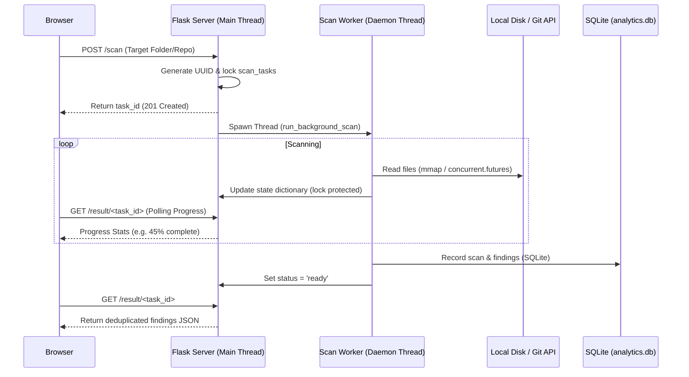

# SecretScanner v1.0

**An Advanced, Highly-Concurrent, Mathematically-Rigorous Secret Detection Engine**

Welcome to the **SecretScanner** codebase. Security tools often feel like black boxes—you point them at a directory, wait for a progress bar, and hope they catch something useful. But building a scanner that is both lightning-fast and mathematically rigorous requires solving some fascinating engineering puzzles. 

This document is a complete technical walkthrough of the architecture, engineering decisions, and the actual math running inside this engine. Whether you're a seasoned systems engineer curious about zero-copy memory mapping, or a newer developer who just wants to understand how we can find a needle in a haystack of code without crashing the server, you're in the right place. Let's dive into how it all works.

---

## Architecture & Engineering Walkthrough
1. [The Concurrency & State Synchronizer](#1-the-concurrency--state-synchronizer)
2. [I/O Guts & Memory Management](#2-io-guts--memory-management)
3. [The Detection Pipeline (The Gauntlet)](#3-the-detection-pipeline-the-gauntlet)
   - [A. Pre-compiled Regex Gating](#a-pre-compiled-regex-gating)
   - [B. Shannon Entropy (Randomness Physics)](#b-shannon-entropy-randomness-physics)
4. [Advanced False-Positive Slayers (Filters)](#4-advanced-false-positive-slayers-filters)
   - [A. Vowel-to-Consonant Ratio Distribution](#a-vowel-to-consonant-ratio-distribution)
   - [B. Naive Bayes Trigram Analysis](#b-naive-bayes-trigram-analysis)
   - [C. Base64 Heuristics Decoder](#c-base64-heuristics-decoder)
   - [D. camelCase/Identifier Transition Thresholds](#d-camelcaseidentifier-transition-thresholds)
5. [Contextual Verification](#5-contextual-verification)
6. [Active Asynchronous Token Validation](#6-active-asynchronous-token-validation)
7. [Windows-Specific Engineering Workarounds (The Hard Stuff)](#7-windows-specific-engineering-workarounds-the-hard-stuff)
8. [Recent Performance & Security Hardening](#8-recent-performance--security-hardening)
9. [Setup & Running the Code](#9-setup--running-the-code)

---

## 1. The Concurrency & State Synchronizer

If you run a heavy scan on a directory containing 10,000 files, the server should not lock up. In web development terms, we absolutely cannot block the **WSGI server** (the gateway interface that runs our Flask application). If the main server is blocked, the user interface freezes, and the entire application becomes unresponsive.

### Daemon Threads to the Rescue
When a `/scan` request comes in, we immediately generate a unique `task_id` and spin up a separate background worker using Python's `threading.Thread`. We explicitly set this thread as a **daemon** (`daemon=True`). A daemon thread runs entirely in the background and will automatically die if the main Flask server crashes or exits. This ensures we never leave "zombie" processes chewing up your CPU after the app shuts down.



### Safely Locking Shared Memory
To keep the frontend updated, the background worker needs to write progress stats (like `scanned_files` and `total_files`) to a place the main server thread can read. We store this in a shared dictionary called `scan_tasks`. 

However, when two different threads try to read and write to the same piece of memory at the exact same time, it causes a **race condition**—a dangerous scenario that can corrupt data or crash the program. To solve this, we wrap all progress updates in a **Thread Lock**. A lock ensures that only one thread can touch the dictionary at any given nanosecond.

```python
scan_tasks_lock = threading.Lock()

def update_progress(task_id, **kwargs):
    with scan_tasks_lock:  # Only one thread can enter this block at a time
        task = scan_tasks.get(task_id)
        if task:
            task.update(kwargs)
```

> [!NOTE]
> **Throttling Updates:** If we locked the dictionary for every single file scanned out of 10,000, the system would spend more time fighting over the lock than actually scanning files—a problem known as *lock contention*. We solve this by throttling the updates. The worker only writes to the shared dictionary at most once every `0.3 seconds`. This is fast enough to keep the UI progress bar perfectly smooth, but slow enough to keep CPU overhead near zero.

---

## 2. I/O Guts & Memory Management

Reading massive log files or dense compiled binaries from a hard drive is slow. Worse, if you load a 2-gigabyte file into Python's memory manager all at once, the program will likely crash with an Out-of-Memory error. Here is how we bypass these physical limitations.

### Standard `read()` vs. Memory Mapping (`mmap`)
When the scanner opens a file, it checks the file's size first:
- **For files under 1MB:** We read them directly into memory with a standard `f.read()`. It's fast and simple.
- **For files over 1MB:** We switch to a **Memory-Mapped File** using Python's `mmap` module.

```python
with open(filepath, 'rb') as f:
    if fsize > 1024 * 1024:  # > 1MB threshold
        with mmap.mmap(f.fileno(), 0, access=mmap.ACCESS_READ) as mm:
            content = mm.read().decode('utf-8', errors='ignore')
```

> [!TIP]
> **Why Memory Mapping Matters:** 
> Normally, reading a file means the Operating System (OS) copies data from the hard drive into a kernel buffer, and then copies it *again* into your Python application's memory space. This double-copy is expensive. 
> `mmap` bypasses this entirely. It maps the file directly into the application's virtual address space. The OS only loads tiny chunks (pages) of the file into physical RAM exactly when the regex engine asks for them. It is practically a **zero-copy** operation, protecting your machine from memory exhaustion even when auditing massive datasets.

### Git Log Streaming (No Disk Writes)
For deep Git history scans, you might assume we check out every historical commit to disk and read it. Doing that would destroy your hard drive's performance and take hours. Instead, we stream the data directly out of Git's internal database using a subprocess pipe:
```python
cmd = ['git', 'log', '-p', '--no-merges', '-E', '--author=^(?!.*(dependabot|github-actions))']
proc = subprocess.Popen(cmd, cwd=repo_dir, stdout=subprocess.PIPE, ...)
```
By reading `proc.stdout` line-by-line, we intercept the raw Git diffs on the fly as they are generated in memory. We never write a single historical file to the disk.

---

## 3. The Detection Pipeline (The Gauntlet)

To achieve extreme speeds, we run every potential secret through "The Gauntlet"—a series of checks ordered strictly from **computationally cheapest** to **most expensive**. If a file or token fails a cheap, early check, we drop it immediately. This ensures we only perform heavy math on the highest-risk candidates.

```text
[Target File Content] 
        │
        ▼
[Fast Prefilter Keyword Gate] ──(No keywords found?)──► Skip File
        │
        ▼
[Pre-compiled Regex Engine] ────(No patterns match)──► Skip Token
        │
        ▼
[Shannon Entropy Check] ────────(Entropy < threshold)──► Drop (Quarantined)
        │
        ▼
[Linguistic / Filter Cascade] ──(Identified as English/ID)──► Drop (Quarantined)
        │
        ▼
[Context & URI Checks] ─────────(Missing context/URL path)─► Drop (Quarantined)
        │
        ▼
[Deduplication & Severity Upgrade]
        │
        ▼
[Asynchronous Verification API]
```

### A. Pre-compiled Regex Gating
Regular expressions (Regex) define structural shapes, like matching `ghp_` followed by exactly 36 alphanumeric characters. Behind the scenes, the regex engine compiles this shape into a **Finite State Automaton (FSA)**—a microscopic state machine that walks through text character by character.

Compiling an FSA takes CPU cycles. If we recompiled our 500+ regex patterns for every file we scan, performance would plummet. Instead, we compile them exactly **once** when the server starts up, holding the fully primed state machines in memory so they can be unleashed instantly on any file.

### B. Shannon Entropy (Randomness Physics)
In information theory, **Shannon Entropy** measures the density of "unpredictability" or "surprise" in a sequence of characters. Cryptographic keys (like AWS access keys) are generated by secure random number generators—they look like pure noise. Human words, however, constantly reuse common letters, making them highly predictable.

The mathematical formula looks like this:
$$ H(X) = - \sum_{i=1}^{n} P(x_i) \log_2 P(x_i) $$

#### An Intuitive Breakdown:
1. $P(x_i)$ is the probability (frequency) of a specific character appearing in our string.
2. $\log_2 P(x_i)$ represents the number of bits theoretically required to encode that character.
3. We sum these values up across all unique characters and negate the result to get a positive entropy score.

#### Visualizing Entropy:
* **`aaaaaaaa` (Entropy = 0.00):** You see the first `a`. The surprise of seeing another `a` is zero. You need 0 bits of information to guess the next character.
* **`password` (Entropy = 2.75):** Low entropy. It relies heavily on common lowercase vowels and consonants.
* **`sk-proj-a1B2c3D4e5F6g7H8i9J0kL...` (Entropy > 4.50):** Highly random. Almost every character is a surprise.

If the calculated entropy of a matched string is lower than our strict limits, we mathematically prove it's just a dummy placeholder or generic word, and we immediately reject it.

---

## 4. Advanced False-Positive Slayers (Filters)

Unfortunately, high entropy doesn't always guarantee a secret. Long camelCase variable names or Base64-encoded icons often masquerade as highly random strings, triggering frustrating false alarms. We built four specialized filters to hunt down and destroy these false positives.

### A. Vowel-to-Consonant Ratio Distribution
Human languages follow distinct physical rules. In English, vowels (`a, e, i, o, u`) consistently make up roughly $35\%$ to $45\%$ of the letters in any given sentence.

Random cryptographic keys don't care about pronounceability. A 30-character AWS key might contain only a single vowel (a ratio near $3\%$), or it might be inexplicably flooded with them. We filter tokens where the vowel ratio falls neatly into the natural English zone ($25\%$ to $45\%$), the string is mostly alphabetic, and the entropy is on the lower side. This reliably assassinates concatenated strings like `ThisIsAVeryLongVariableNameToStoreState` that slip past basic regex.

### B. Naive Bayes Trigram Analysis
A **trigram** is a sequence of three consecutive letters (like `the`, `ing`, or `key`). In English text, certain trigrams appear constantly, while others (like `qxz`) are virtually nonexistent.

We implement a **Naive Bayes Classifier**, referencing a pre-computed dictionary of log-likelihood values mapped to English text patterns:
```python
TRIGRAM_LOG_LIKELIHOOD = {
    'the': 3.5, 'and': 3.2, 'ing': 3.4, ...
}
```

> [!IMPORTANT]
> **Why Log-Likelihoods? (Solving Floating-Point Underflow)**
> In probability, to find the combined probability of multiple independent events, you multiply their probabilities together ($P(A \cap B) = P(A) \times P(B)$). 
> 
> If we did this for a 40-character string, we'd be multiplying twenty microscopic decimals (like $0.002 \times 0.0001 \times \dots$), resulting in an astronomically tiny number like $10^{-45}$. Modern computer CPU registers simply cannot handle numbers this small—they will round them off to exactly `0.00`. This hardware limitation is called **floating-point underflow**. 
> 
> To fix this, we take the natural log of the probabilities. In math, adding logarithms is equivalent to multiplying the original numbers ($\log(A \times B) = \log(A) + \log(B)$). By adding scores instead of multiplying, we bypass the hardware limits. If the average score across the string is $> 0.60$, the string is mathematically classified as English text and safely discarded.

### C. Base64 Heuristics Decoder
Developers love encoding text (like HTML snippets, SVG paths, or JSON configs) into Base64 formats for safe transit over networks. Because Base64 looks like random gibberish, it has inherently high entropy and triggers false alarms constantly.

Our heuristics decoder actively tries to decode suspicious strings on the fly:
1. It validates the length (is it a clean multiple of 4?).
2. It attempts a safe `base64.b64decode()`.
3. If it successfully decodes the gibberish into valid UTF-8 plaintext, we analyze the plaintext's entropy and structure. If the decoded result turns out to be plain human text (entropy $< 3.5$), we discard the original Base64 token.

### D. camelCase/Identifier Transition Thresholds
Programming variables (classes, constants) have very specific internal structures. We analyze strings by counting "transitions":
* **camelCase / PascalCase transitions:** An uppercase letter immediately following a lowercase letter (`[a-z][A-Z]`).
* **Numeric transitions:** A letter followed by numbers followed by an uppercase letter (`[A-Za-z][0-9]+[A-Z]`).

If the sum of these visual transitions is $\ge 4$ (for example, `getOAuthTokenFromService`), it's almost certainly a programming class name or a compiler-mangled symbol (which are common in C++ or Swift binary dumps), and definitely not a raw secret key.

---

## 5. Contextual Verification

To stop matching random strings of text that just happen to look like secrets, we analyze the structural environment surrounding the token.

* **URI Routing Check:** We scan a 120-character "window" around the token. If we find URL path segments (like `/assets/`, `/status/`, or `/commits/`) directly bordering the token, we drop it. In this context, it is clearly a resource ID or routing parameter, not a secret.
* **Assignment Verification:** A real secret is almost always assigned to a variable or passed as a parameter. We verify if the surrounding context window contains assignment operators (`=`, `:`) or explicit intent keywords (`key`, `secret`, `token`, `password`, `bearer`). If the text is just floating with no assignment context, it is ignored.
* **De-duplication & Upgrading:** If a specific token appears multiple times in a file, it's often a structural code format rather than a leaked key. We dynamically deduct its threat score. Conversely, if a generic key is discovered but is later matched by a hyper-specific provider rule (like Stripe), the generic finding is automatically merged and upgraded to the higher-fidelity specific finding.

---

## 6. Active Asynchronous Token Validation

Finding a secret is only half the battle. Once a secret survives the rigorous filter pipeline, we actively verify if it is alive and dangerous.

### ThreadPool API Checking
Because network validation requires connecting over the public internet, a single slow HTTP request to a dead server shouldn't block the rest of the scan. We deploy a `ThreadPoolExecutor` running up to 10 parallel HTTP check workers. We enforce a strict **3-second timeout** on all outbound connections to ensure the scanner never hangs on unresponsive endpoints.

### Google API Key Handling
Google APIs are notoriously deceptive. They will often return a completely healthy `200 OK` status code, but embed a `REQUEST_DENIED` message deep inside the JSON body. Our validator handles this edge case by inspecting the actual payload:
* If it sees `REQUEST_DENIED` alongside an "invalid key" message, it flags the key as `inactive`.
* If it receives a `403 Forbidden` response, it parses Google's specific JSON error reasons (e.g., `API_KEY_IP_ADDRESS_BLOCKED` or `BILLING_DISABLED`). If these reasons are present, it proves the key is mathematically correct and **valid, but restricted** by IP or billing policies, properly classifying it as `active (Restricted)`.

---

## 7. Windows-Specific Engineering Workarounds (The Hard Stuff)

Writing deep systems code that works flawlessly on Windows is notoriously tricky due to OS-level file locking and path length limits. Here is how we engineered around two major Windows roadblocks:

### A. Windows File Lock Mitigation (Quarantine Logger)
On Windows, if one thread opens a file handler to write a log, the OS aggressively locks it. Other threads cannot edit or delete that file, instantly throwing a `PermissionError`. 
Our `setup_quarantine_logger` seamlessly resolves this by generating cryptographically unique quarantine filenames on the fly (e.g., `quarantine_a1b2c3.log`).

### B. The Deep Temp Directory Purge (The Robocopy Trick)
When scanning large Git repositories, nested folders can easily create file paths longer than the strict Windows path limit of 260 characters (`MAX_PATH`). Standard Python commands like `shutil.rmtree` will completely fail to delete these folders, crashing the cleanup process with access denied errors.

We implemented a battle-tested folder-removal workaround using Windows' built-in `robocopy` utility:
```python
if os.name == 'nt':
    empty_dir = tempfile.mkdtemp(prefix="empty_")
    subprocess.run(
        ['robocopy', empty_dir, path, '/MIR', '/R:1', '/W:1'],
        stdout=subprocess.DEVNULL, stderr=subprocess.DEVNULL, timeout=60
    )
    shutil.rmtree(path, ignore_errors=True)
    shutil.rmtree(empty_dir, ignore_errors=True)
```
#### How this magic works:
1. We create a completely empty temporary folder.
2. We call `robocopy` with the `/MIR` (mirror) flag, targeting the deeply nested directory. This forces the OS kernel to mirror the empty directory into our overly-deep path.
3. Because the mirror target must strictly match the source, Windows happily deletes all files and nested folders at a very low filesystem level. This completely bypasses the path limit errors and forcibly releases any locked file handles.
4. We can then cleanly wipe the now-empty folder structure from the drive.

---

## 8. Recent Performance & Security Hardening

To make SecretScanner production-ready, we recently implemented several critical low-level optimizations:
- **Zero-Copy Pre-Filter:** We precompile our `FAST_KEYWORDS` into a case-insensitive regex `_PREFILTER_RE`. This allows O(n) checking against raw file buffers without allocating costly lowercase string copies in memory, saving gigabytes of RAM during massive scans.
- **O(log n) Line Number Lookup:** Instead of running a quadratic scan to count newlines for every single regex match, we build an indexed array of newline offsets exactly once (`build_line_index`). We then use Python's `bisect` library to perform lightning-fast binary-search line lookups.
- **O(n) Shannon Entropy:** We replaced the slow O(n·k) `list.count()` implementation with Python's built-in C-optimized `collections.Counter` and `math.log2`, running significantly faster on long tokens.
- **tarfile CVE Prevention:** We implemented a rigorous `safe_extract()` function that explicitly asserts all archive members reside safely within the target directory boundary before extracting them. This permanently closes path traversal vulnerabilities when scanning malicious zip or tar archives.
- **Batched SQLite Writes:** The background thread now bundles all scan findings into a single bulk transaction and applies `PRAGMA journal_mode=WAL`. This dramatically reduces disk I/O and ensures lock-free parallel reads from the analytics dashboard.

---

## 9. Setup & Running the Code

The engine runs entirely on the Python standard library for its mathematical calculations and AST filters. The only external dependency required is the Flask web framework.

### Installation
1. Ensure you are running Python 3.8 or higher.
2. Install Flask:
   ```bash
   pip install flask
   ```

### Running the App
Start the application server:
```bash
python app.py
```
The engine will automatically clean up any old zombie port allocations, initialize the SQLite telemetry database (`analytics.db`), and spin up the dashboard at `http://127.0.0.1:5000`.

### Git Pre-Commit Hook Integration
Want to block secrets before they ever leave your computer? 
1. Open your dashboard at `http://127.0.0.1:5000`.
2. Download the pre-commit script.
3. Drop it into your project's `.git/hooks/` directory, name it exactly `pre-commit`, and make it executable:
   ```bash
   chmod +x .git/hooks/pre-commit
   ```
Every time you run `git commit`, the hook will instantly intercept your staged changes, run the local entropy and dummy checks, and violently block the commit if a leak is detected!
